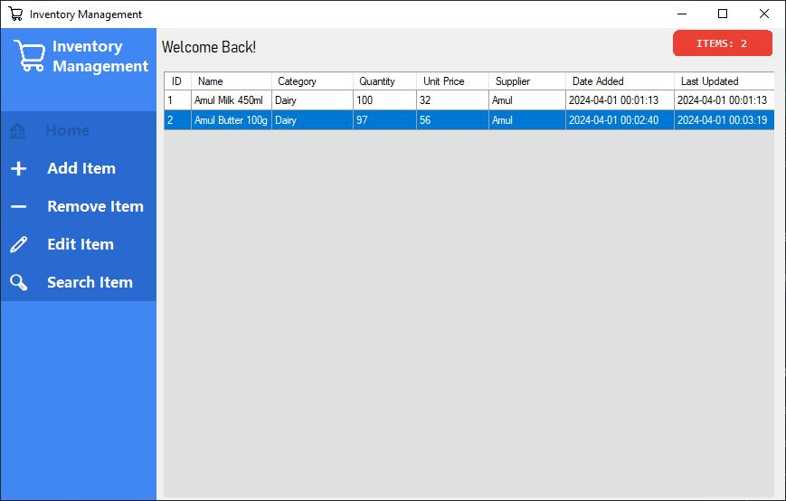
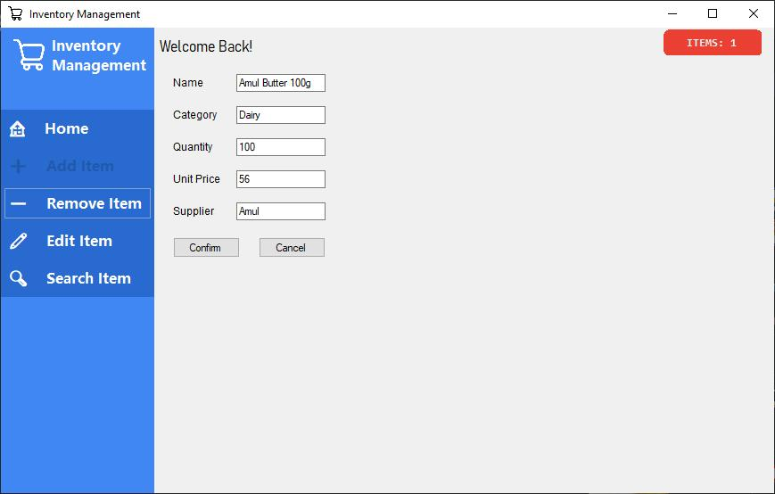
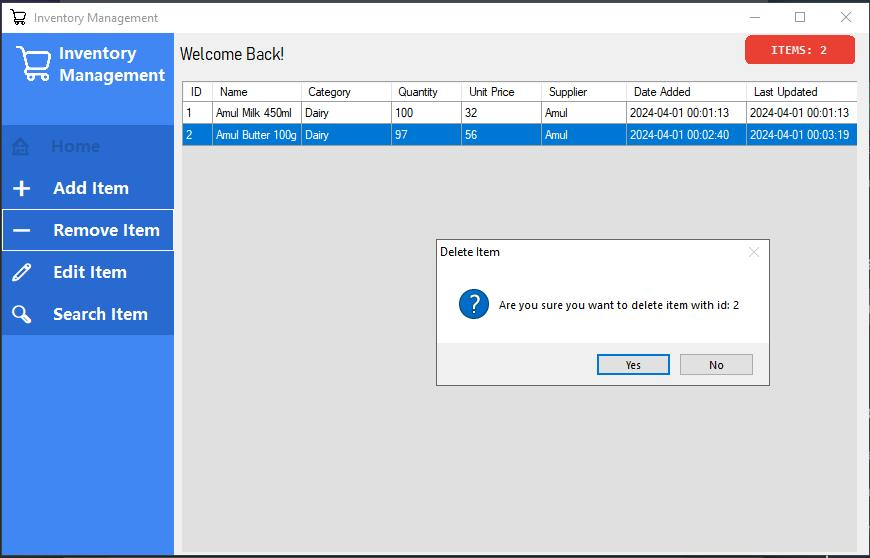
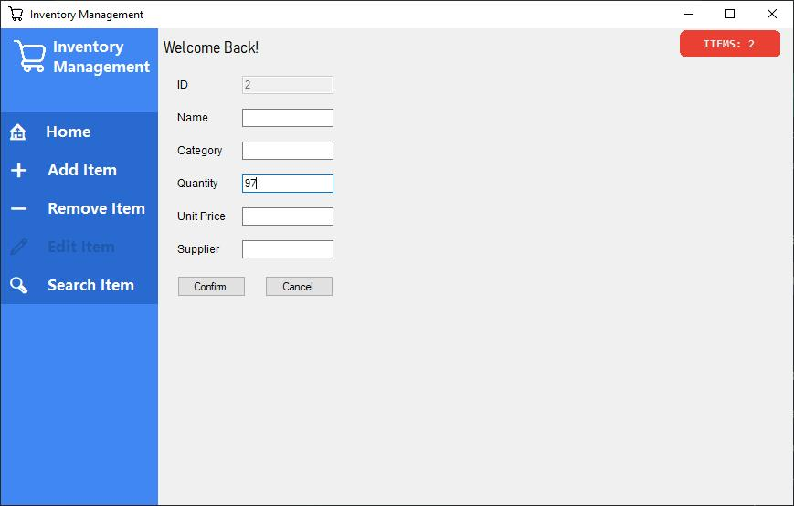
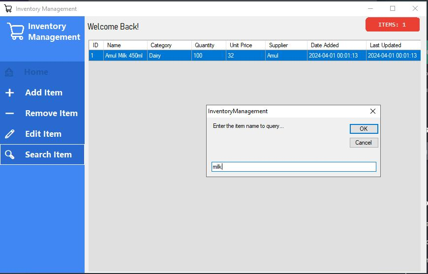

# 📦 Inventory Management System

A simple and intuitive Windows Forms application built with VB.NET to help you manage your inventory with ease! Keep track of your items, add new ones, remove old ones, make edits, and find exactly what you're looking for.

  

## ✨ Key Features

* **📊 Display Items:** See all your inventory in a neat table!
    * ID, Name, Category, Quantity, Price, Supplier, Date Added, Last Updated.
    * Real-time updates as you make changes!
* **➕ Add Item:** Quickly add new items.
    * Automatic unique ID generation.
    * Timestamp for when it was added.
* **➖ Remove Item:** Delete items with a click.
    * Confirmation prompts to prevent oopsies!
* **✍️ Edit Item:** Update item details seamlessly.
    * Keep your data accurate and up-to-date.
* **🔍 Search Item:** Find items fast!
    * Search by ID, name, category, and more.
    * Filtered results for quick retrieval.

## 📸 Screenshots

### Add Item

### Remove Item

### Edit Item

### Search Item

